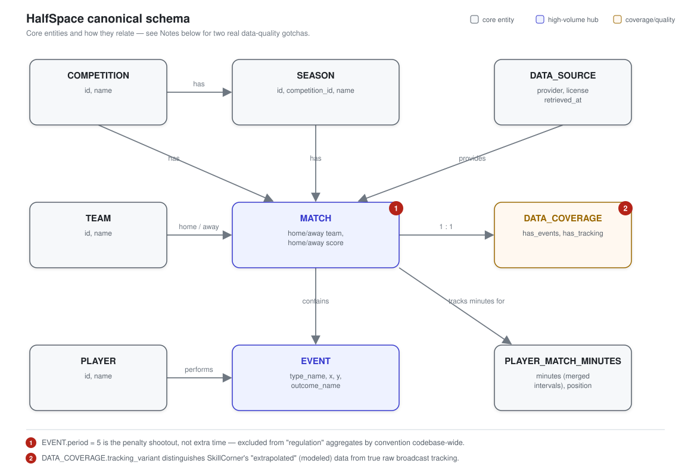

# The HalfSpace

Football intelligence explorer — a research/portfolio project over real open football
data (StatsBomb event data, SkillCorner/IDSSE tracking), built as a layered
raw → canonical → derived → API pipeline, not a demo dashboard over fake numbers.

## Architecture


Every layer left of FastAPI is disk-backed and inspectable on its own —
nothing here calls StatsBomb live on a request path. See [Run it](#run-it)
for how the layers get built.

## Canonical schema



`DATA_COVERAGE` exists so the app can be honest about what backs any given
match — some matches will only ever have basic data, and that has to be
visible, not silently degraded (see project spec §8).

## Status

**Phases 1-4 (data layer, analytics, API, frontend) — done.**

Phase 3 added a real API surface over everything Phase 2 validated: player/team
season profiles, role-aware similarity, head-to-head comparison (with a
role-mismatch caveat when the comparison isn't apples-to-apples — the API
itself can flag "this comparison may not be meaningful," not just the agent
layer later), sequence search, tracking lookups, and a 19-concept tactical
ontology where every concept is honestly tagged with one of 5 confidence
tiers (`educational` / `analytical` / `detectable` / `tracking_dependent` /
`unsupported`) rather than presenting explanation and detection as the same
thing. 26/26 tests pass, all against the real 495+17-match dataset.

Phase 4 is a React/Vite frontend (`frontend/`) — Explore, Matches, Players,
Teams, Tactics, Compare, all reading the real API, no mocked data anywhere.
Visually verified in an actual browser (Playwright screenshots), not just
"the dev server started" — that process caught two real bugs:

- A dangling tactical-ontology reference (`pressing-trap` and `verticality`
  were linked from other concepts but never defined - would 404). Fixed by
  writing the missing concepts, not by deleting the links.
- `season_player_profiles`/`season_team_profiles` took 3.5-4.3 seconds per
  request (a full Python-level scan of every event in the competition/season -
  700k+ rows for La Liga). Fixed with a process-lifetime cache plus an
  API-startup warm pass, so no user - not even the first one - ever sees that
  latency. Verified: 4.3s → ~15ms.

Design: dark-first, amber/clay/teal-green/blue categorical palette validated
against the dataviz skill's colorblind-safety + contrast checks on our actual
surfaces (not hand-picked), Big Shoulders Display + IBM Plex type pairing,
a coverage-strip signature element (three ticks: events/tracking/360) that
appears on every match/player/team card so the UI never implies richer data
than what's actually there.

Manually verified real output, not just green tests: `/teams/compare` for
Spain vs Morocco (WC2022) correctly returns Spain's actual 4 matches and
Morocco's actual 7 (their real tournament runs), with goal rates matching
each team's known style.

| Competition / provider | Matches | Kind |
|---|---|---|
| FIFA World Cup 2022 | 64 (full) | StatsBomb event data |
| La Liga 2015/16 | 380 (full season) | StatsBomb event data |
| UEFA Euro 2024 | 51 (full) | StatsBomb event data |
| SkillCorner Open Data (A-League 2024/25) | 10 (full) | Broadcast tracking, modeled/extrapolated |
| IDSSE (Bundesliga 2022/23, 1./2. div) | 7 (full) | True optical tracking, 25fps |
| **Total** | **495 event matches + 17 tracking matches** | |

`tests/test_data_quality.py` runs against this live dataset (not just
fixtures) and caught two real bugs, both fixed at the shared ingestion layer
rather than patched per-caller:

- **Minutes-played bug**: WC2022 final's own lineup data has an overlapping/
  mislabeled position segment for Messi that summed to 185 minutes. Fixed by
  merging overlapping intervals instead of summing raw segment durations →
  correct 124 minutes.
- **Home/away bug**: team assignment and scores were being guessed from event
  order in the event stream. Now sourced from the real competition match-list
  endpoint.

Domains validated end-to-end on real data so far:

| Domain | What was tested | Result |
|---|---|---|
| Match intelligence | Shot map, goal timeline, passing — WC2022 Final | Correct 3-3 (ET), shootout excluded |
| Tactical intelligence | PPDA press-intensity across all 64 WC2022 matches | Spain/Germany rank as top pressers, Morocco/Qatar/Costa Rica as deep blocks — matches known tactics |
| Player intelligence | Full-season (380-match) per-90 profiling + role-aware similarity | Suárez tops goals/90 (real Pichichi winner); Messi↔Neymar is the top similarity match |
| Sequence search | Heuristic counterattack detector | Works, correctly labeled medium-confidence, not a trained classifier |
| Shot quality (xG-lite) | Logistic regression, 11,937 real shots, distance/angle/header | AUC 0.79, Brier 0.083 — in line with published xG models, coefficient signs all football-sane |
| Spatial/tracking | Team compactness across two independent providers (broadcast-modeled + true optical) | 17 real matches, 34 team-rows; SkillCorner and IDSSE land in the same physical range despite different leagues/methods — a real cross-provider sanity check, not just "it ran" |

## Why SQLite, not Postgres, right now

Local Postgres exists but needs interactive `sudo` auth this environment
can't provide non-interactively. SQLite (stdlib, zero setup) unblocks the
build today. The schema is plain SQL, not ORM-coupled, so porting to
Postgres + pgvector later is a schema port, not a rewrite. Upgrade trigger:
similarity search needs pgvector, or multi-writer access actually matters —
not preemptively.

## Layout

```
halfspace/
  db.py                   canonical schema (SQLite)
  api.py                  FastAPI surface (same tools the agent layer will call later)
  tactical.py              loads tactical_concepts.json
  tactical_concepts.json   19 concepts, each tagged with a confidence tier - not a DB table (too small to earn one)
  ingest/
    statsbomb.py          fetch (cached) + load StatsBomb open-data matches
    skillcorner.py         fetch (LFS-aware, cached) + compute team compactness
    idsse.py               fetch + stream-parse DFL tracking XML, compute team compactness
  features/
    __init__.py            shared match-scoped logic (period-scoping, PPDA, progressive passes)
    player.py               season per-90 profiles + role-aware similarity
    team.py                 season PPDA/goals/shots aggregation
    sequences.py            counterattack heuristic detector
    shot_quality.py         xG-lite logistic regression model
    spatial.py               reads tracking_team_match (SkillCorner + IDSSE)
scripts/
  ingest_match.py          CLI: ingest one StatsBomb match by id
  ingest_competition.py    CLI: bulk-ingest a full competition/season, idempotent
  ingest_skillcorner.py    CLI: ingest all 10 SkillCorner matches
  ingest_idsse.py          CLI: ingest all 7 IDSSE matches (~2.5GB download)
  train_shot_model.py      CLI: train + evaluate the shot-quality model
tests/
  test_pipeline.py         smoke test against a real fixture match (WC2022 Final)
  test_data_quality.py     sanity checks against the live ingested dataset
  test_analytics.py        known-fact checks (Suárez, Messi/Neymar, Spain's press...)
  test_spatial.py          plausible-range checks on tracking data
  test_api.py              endpoint tests against the live dataset
  fixtures/                 small, real, committed StatsBomb JSON (no network needed for tests)
frontend/                  React + Vite + TypeScript, reads the API above, no mocked data
  src/lib/api.ts            typed client, one function per endpoint
  src/components/           CoverageStrip (signature element), PitchShotMap, CompareBar, ConfidenceBadge
  src/pages/                Explore, Matches, MatchDetail, Players, PlayerDetail, Teams, Tactics, TacticDetail, Compare
```

Raw fetched data lives in `data/raw/` and is **not** committed — it's cached
locally so re-running ingestion doesn't re-hit the network (this matters more
for tracking: ~3.4GB combined), but it's fully reproducible from the fetch
logic in `halfspace/ingest/`. The fixture files under `tests/fixtures/` are
the one deliberate exception: small, real, and committed so tests run offline.

## Run it

```bash
python3 -m venv .venv && .venv/bin/pip install -r requirements.txt
.venv/bin/python3 -m pytest tests/ -v

# one match:
.venv/bin/python3 scripts/ingest_match.py 3869685 43 106        # WC2022 Final

# a full competition:
.venv/bin/python3 scripts/ingest_competition.py 43 106          # WC2022, all 64 matches

.venv/bin/uvicorn halfspace.api:app --reload
# then: curl localhost:8000/matches/3869685/profile

# frontend (separate terminal):
cd frontend && npm install && npm run dev
# then open http://localhost:5173
```

Backend startup pre-warms the player/team season-profile caches for every
ingested competition (a few seconds, one-time) - see "Known gotchas" below
for why that exists.

## Known gotchas already found and handled

- StatsBomb events include the penalty shootout as `Shot` events at `period=5` —
  anything reporting "the match" must scope to periods 1-4 or shootout goals get
  double-counted as regulation goals. Handled once in `features.match_events`.
- Naive "progressive pass" (≥25% closer to goal) trivially rewards goalkeeper
  long punts. `features.player_progressive_passes` excludes GKs by default.
- Lineup position segments can overlap or be mislabeled in the source data
  (see the Messi/185-minutes bug above) — minutes are computed by merging
  intervals, not summing raw segment durations.
- SkillCorner tracking files are Git-LFS — `raw.githubusercontent.com` silently
  returns a pointer file, not data. Needs `media.githubusercontent.com/media/...`.
  Handled in `halfspace/ingest/skillcorner.py`.
- IDSSE was assumed earlier in this project to need HuggingFace auth resolution -
  that assumption was wrong, checked directly against the HF API (`"gated": false,
  "private": false`) rather than left standing. It's fully public.
- IDSSE's positions file is ~350-420MB of XML per match, one `<FrameSet>` per
  player/referee/ball containing thousands of `<Frame>` elements at 25fps.
  Loading it as a full DOM tree isn't viable - `halfspace/ingest/idsse.py`
  streams it with `lxml.etree.iterparse` and downsamples (every 25th frame,
  ~1/sec) since a team-shape aggregate doesn't need full 25fps resolution.
- `season_player_profiles`/`season_team_profiles` scan every event in a
  competition/season in a Python loop (700k+ rows for La Liga) - measured at
  3.5-4.3 seconds per call. Fixed with a process-lifetime cache (`_profile_cache`
  in `halfspace/features/player.py` and `team.py`) plus an API-startup warm
  pass (`warm_caches()` in `halfspace/api.py`), not just a per-request cache -
  restart the API after re-ingesting a competition to pick up new data.
- A StatsBomb shot's `x` coordinate is already relative to the shooting team's
  own attacking direction (both teams' shots cluster near x=120, not split
  across physical pitch ends) - verified against real WC2022 Final data before
  building the shot map, not assumed. No attacking-direction-flip logic needed.
