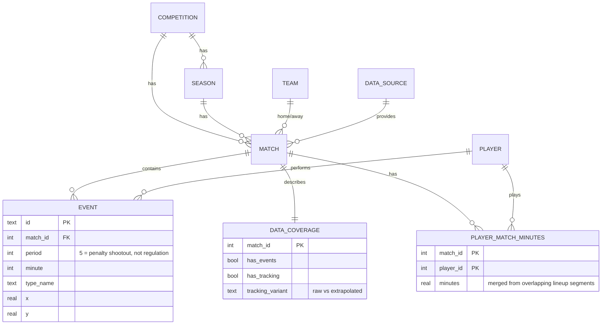

# The HalfSpace

Football intelligence explorer — a research/portfolio project over real open football
data (StatsBomb event data, SkillCorner/IDSSE tracking), built as a layered
raw → canonical → derived → API pipeline, not a demo dashboard over fake numbers.

## Architecture

```mermaid
flowchart LR
    subgraph Source["Source"]
        SB["StatsBomb Open Data\n(GitHub, static JSON)"]
    end

    subgraph Raw["Raw layer"]
        Cache["data/raw/\nfetched once, cached, gitignored"]
    end

    subgraph Canonical["Canonical layer"]
        DB[("SQLite\nhalfspace/db.py")]
    end

    subgraph Derived["Derived / feature layer"]
        Feat["halfspace/features.py\nPPDA, progressive passes,\nshot summary, goals"]
    end

    subgraph App["Application layer"]
        API["FastAPI\nhalfspace/api.py"]
    end

    SB -- "fetch once" --> Cache
    Cache -- "ingest_competition.py" --> DB
    DB --> Feat
    Feat --> API
    API -- "not built yet" -.-> Frontend["React frontend"]
    API -- "not built yet" -.-> Agent["Tool-calling agent"]
```

Every layer is disk-backed and inspectable on its own — nothing here calls
StatsBomb live on a request path. See [Run it](#run-it) for how the layers
get built.

## Canonical schema



`DATA_COVERAGE` exists so the app can be honest about what backs any given
match — some matches will only ever have basic data, and that has to be
visible, not silently degraded (see project spec §8).

## Status

**Phase 1 (canonical data layer) — done.**

| Competition | Matches | Source |
|---|---|---|
| FIFA World Cup 2022 | 64 (full) | StatsBomb Open Data |
| La Liga 2015/16 | 380 (full season) | StatsBomb Open Data |
| UEFA Euro 2024 | 51 (full) | StatsBomb Open Data |
| **Total** | **495 real matches, ~1.7M events** | |

`tests/test_data_quality.py` runs against this live dataset (not just
fixtures) and caught two real bugs, both fixed at the shared ingestion layer
rather than patched per-caller:

- **Minutes-played bug**: WC2022 final's own lineup data has an overlapping/
  mislabeled position segment for Messi that summed to 185 minutes. Fixed by
  merging overlapping intervals instead of summing raw segment durations →
  correct 124 minutes.
- **Home/away bug**: team assignment and scores were being guessed from event
  order in the event stream. Now sourced from the real competition match-list
  endpoint.

Domains validated end-to-end on real data so far:

| Domain | What was tested | Result |
|---|---|---|
| Match intelligence | Shot map, goal timeline, passing — WC2022 Final | Correct 3-3 (ET), shootout excluded |
| Tactical intelligence | PPDA press-intensity across all 64 WC2022 matches | Spain/Germany rank as top pressers, Morocco/Qatar/Costa Rica as deep blocks — matches known tactics |
| Player intelligence | Full-season (380-match) per-90 profiling + role-aware similarity | Suárez tops goals/90 (real Pichichi winner); Messi↔Neymar is the top similarity match |
| Sequence search | Heuristic counterattack detector | Works, correctly labeled medium-confidence, not a trained classifier |
| Spatial/tracking | Team compactness from real SkillCorner broadcast tracking | Differentiated width/length per team |

## Why SQLite, not Postgres, right now

Local Postgres exists but needs interactive `sudo` auth this environment
can't provide non-interactively. SQLite (stdlib, zero setup) unblocks the
build today. The schema is plain SQL, not ORM-coupled, so porting to
Postgres + pgvector later is a schema port, not a rewrite. Upgrade trigger:
similarity search needs pgvector, or multi-writer access actually matters —
not preemptively.

## Layout

```
halfspace/
  db.py                 canonical schema (SQLite)
  features.py            shared feature logic (period-scoping, PPDA, progressive passes)
  ingest/
    statsbomb.py         fetch (cached) + load StatsBomb open-data matches
  api.py                 FastAPI surface (same tools the agent layer will call later)
scripts/
  ingest_match.py        CLI: ingest one match by id
  ingest_competition.py  CLI: bulk-ingest a full competition/season, idempotent
tests/
  test_pipeline.py       smoke test against a real fixture match (WC2022 Final)
  test_data_quality.py   sanity checks against the live ingested dataset
  fixtures/               small, real, committed StatsBomb JSON (no network needed for tests)
```

Raw fetched JSON lives in `data/raw/` and is **not** committed — it's cached
locally so re-running ingestion doesn't re-hit the network, but it's fully
reproducible from the fetch logic in `halfspace/ingest/`. The fixture files
under `tests/fixtures/` are the one deliberate exception: small, real, and
committed so tests run offline.

## Run it

```bash
python3 -m venv .venv && .venv/bin/pip install -r requirements.txt
.venv/bin/python3 -m pytest tests/ -v

# one match:
.venv/bin/python3 scripts/ingest_match.py 3869685 43 106        # WC2022 Final

# a full competition:
.venv/bin/python3 scripts/ingest_competition.py 43 106          # WC2022, all 64 matches

.venv/bin/uvicorn halfspace.api:app --reload
# then: curl localhost:8000/matches/3869685/profile
```

## Known gotchas already found and handled

- StatsBomb events include the penalty shootout as `Shot` events at `period=5` —
  anything reporting "the match" must scope to periods 1-4 or shootout goals get
  double-counted as regulation goals. Handled once in `features.match_events`.
- Naive "progressive pass" (≥25% closer to goal) trivially rewards goalkeeper
  long punts. `features.player_progressive_passes` excludes GKs by default.
- Lineup position segments can overlap or be mislabeled in the source data
  (see the Messi/185-minutes bug above) — minutes are computed by merging
  intervals, not summing raw segment durations.
- SkillCorner tracking files are Git-LFS — `raw.githubusercontent.com` silently
  returns a pointer file, not data. Needs `media.githubusercontent.com/media/...`.
  (Not yet wired into an ingestion module — noted here so it isn't rediscovered.)
